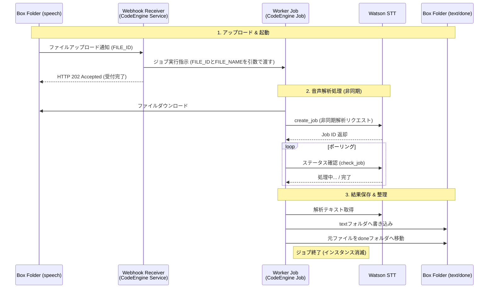
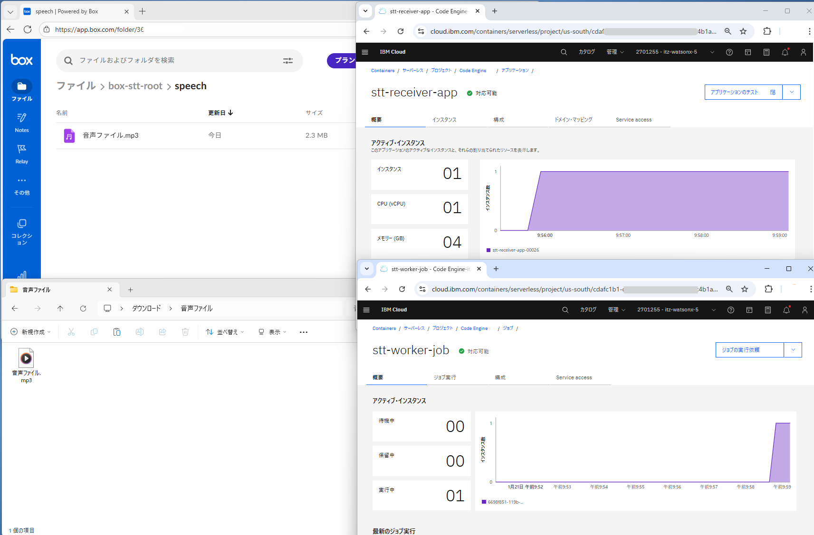

# Box音声ファイル自動書き起こしアプリ（box-stt） のご紹介とリポジトリ利用ガイド

Boxにアップロードされた音声ファイルを、IBM Cloud CodeEngine と Watson Speech to Text (STT) を利用して自動でテキスト化するサーバーレス・パイプラインの解説と当リポジトリを活用した構築手順です。

## 1. 概要

特定のBoxフォルダに音声ファイルが保存されると、Webhookを介してCodeEngine（Receiver）が起動し、解析用Worker Jobをバックグラウンドでキックします。解析完了後、テキストをBoxへ保存し、元の音声ファイルを整理用フォルダに移動します。

## 2. システムアーキテクチャ

### 2-1. アーキテクチャー図


### 2-2. シーケンス図


### 2-3. リポジトリ構成

* `ce_receiver.py`: Webhook受信、Job（`ce_worker.py`）キック。
* `ce_worker.py`: 音声テキスト書き起こし、Box操作。
* `ce_utils.py`: ログ基盤。
* `Dockerfile`: 共通実行環境。
* `env.sample`: 環境変数のテンプレート。

## 3. 作業の前提条件

本手順を開始する前に、以下のリソースがプロビジョニング済みであることを確認してください。

1. **IBM Cloud Watson Speech to Text**: サービスインスタンスが作成されていること。
2. **IBM Cloud CodeEngine**: プロジェクトが作成済みであること。
3. **IBM Cloud Container Registry**: 名前空間（Namespace）が作成済みであること。
4. **Box アカウント**: 開発者コンソールおよび管理コンソールへのアクセス権限があること。
5. **ローカル環境**:
   * **Docker CLI**: イメージのビルドに必要です。
   * **IBM Cloud CLI**: インストールは[公式ガイド](https://cloud.ibm.com/docs/cli?topic=cli-install-ibmcloud-cli)を参照してください。

## 4. 詳細構築手順

### STEP 1: ローカル環境の準備

1. 本リポジトリをクローンします。
2. `env.sample` をコピーして `.env` ファイルを作成します。以降の手順で取得する値は、この `.env` の該当項目に順次貼り付けてください。

### STEP 2: IBM CLoud API key (IAM) の取得

1. IBM Cloud のAPIキーを取得済みの場合はそれを利用します。TechZone環境で提供済みの場合はそれを確認します。
2. 取得できていない場合は、IBM Cloud コンソールの「管理」>「アクセス（IAM）」、左側メニュー「APIキー」よりAPIキーを作成します。
3. `.env` の `IBM_CLOUD_API_KEY` に貼り付けます。

### STEP 3: Watson STT 資格情報の取得

1. IBM Cloud コンソールで Watson Speech to Text インスタンスを開きます。
2. 左メニュー「管理」から **API キー** をコピーし、`.env` の `STT_API_KEY` に貼り付けます。
3. 同画面の **URL** をコピーし、`.env` の `STT_SERVICE_URL` に貼り付けます。

### STEP 4: Box フォルダの作成と権限設定

1. Box ユーザー画面で、本システム用の親フォルダ（例: `box-stt-root`）を作成します。
2. 親フォルダの中に、以下の 3 つの子フォルダを作成します。
   * `speech`（音声投入用）
   * `text`（テキスト出力用）
   * `done`（処理済み移動用）
3. 各フォルダを開き、ブラウザの URL 末尾にある数字（フォルダ ID:../folder/nnnnnnnnnnnn）をコピーして、`.env` の `BOX_SPEECH_FOLDER_ID`, `BOX_TEXT_FOLDER_ID`, `BOX_DONE_FOLDER_ID` にそれぞれ貼り付けます。

### STEP 5: Box Platform アプリケーションの定義

1. **アプリ作成**: [Box開発者コンソール](https://app.box.com/developers/console)の「Platformアプリ」画面で「新規アプリ＋」を選択。
   * **アプリ名**: 任意のアプリケーション名（例: `box-stt`）
   * **アプリタイプ**: 「クライアント資格情報許可」を選択。
2. **基本情報取得**: 「構成」タブで以下を確認します。
   * **クライアント ID**: コピーし、`.env` の `BOX_CLIENT_ID` へ貼り付けます。
   * **クライアントシークレット**: 「クライアントシークレットを取得」で得られた文字列をコピーし、`.env` の `BOX_CLIENT_SECRET` へ貼り付けます。
3. **アプリケーションスコープ**: 以下にチェックを入れます。
   * `Boxに格納されているすべてのファイルとフォルダへの書き込み`
   * `Webhook管理する`
4. **エンタープライズID取得**: 「一般設定」タブで以下を確認します。
   * **Enterprise ID**: 画面下部から確認し、`.env` の `BOX_ENTERPRISE_ID` へ貼り付けます。
5. **承認依頼**: 「承認」タブで以下を確認します。
   * **「確認して承認」**: ボタンを押し管理者に承認依頼する。
6. **アプリの承認**:
   * [Box 管理コンソール](https://app.box.com/master) > 統合 > Platformアプリマネージャ > サーバー認証アプリのリストから対象のアプリの3点リーダ「...」から「アプリの（再）承認」を選び本アプリを承認します。
7. **親フォルダへの招待**:
   * 開発者コンソールに戻り、対象アプリの「一般設定」タブにある **「サービスアカウント情報」** の **Service Account ID**（自動生成されたメールアドレス形式のもの）をコピーします。
   * Box ユーザー（フォルダ）画面に戻り、STEP 3 で作成した **親フォルダ** の **「共有」** ポップアップの **ユーザーを招待** に、このサービスアカウントを「編集者として招待」で「送信」します。

### STEP 6: コンテナイメージのビルドとプッシュ

1. **CLIへのログイン**:
   * IBM Cloud コンソール右上のアバターをクリックし、「CLI と API にログイン」を選択する。
   * 表示されたログインコマンドをコピーし、ターミナルで実行する。
   * 「Select a region（リージョンの選択）」にて、IBM Cloud Container Registryが稼働するリージョンを選択する。
2. **プラグインの確認**:
   Container Registry 操作用のプラグインが未導入の場合は、下記コマンドでインストールしてください。
   ```bash
   ibmcloud plugin install container-registry
   ```
3. **名前空間の確認（または作成）**
   ```bash
   # 既存の名前空間の確認
   ibmcloud cr namespaces
   ```
   名前空間が存在しない場合はIBM Cloud コンソールか、以下のコマンドにて作成します。
   `ibmcloud cr namespace-add <名前空間名>`
   
4. `Dockerfile` を使用してイメージをビルドします。
   * Container Registryのドメインと名前空間を使用して`docker`コマンドを実行する。
   * CRドメイン: jp-tokの場合 `jp.icr.io`、en-southの場合 `icr.io` を使用する。
   ```bash
   ibmcloud cr login
   docker build -t [CRドメイン]/[名前空間名]/box-stt:latest .
   docker push [CRドメイン]/[名前空間名]/box-stt:latest
   ```

### STEP 7: シークレットの設定
対象の Code Engine プロジェクト画面の左メニューから「シークレットおよびConfigMap」を選択し、以下の2種類のシークレットを作成します。
1. **レジストリー・シークレットの作成**:Code Engine が Container Registry からイメージをプルするために必要です。
   * 「作成」＞「レジストリー・シークレット」を選択。
   * **シークレット名**: 任意の名前（例: jp-icr-secret）
   * **ターゲット**: IBM Container Registry
   * **ロケーション**: 使用しているCRのリージョン（例: 東京(private.jp.icr.io)）
   * IAM API キー: 作成済みの IBM Cloud API Key を入力。
       * 未取得の場合は「管理」＞「アクセス(IAM)」＞「API キー」から作成。
2.  **一般シークレットの作成**:アプリケーション（.env）で使用する全ての機密情報を一括管理します。
   * 「作成」＞「一般シークレット」を選択。
   * **シークレット名**: 任意の名前（例: app-job-secret）
   * **キーと値のペア**: .env ファイルに記載されている内容をすべて「キー」と「値」の形式で入力します。
      * STT_API_KEY / STT_MODEL / BOX_CLIENT_SECRET など、すべての項目をここに追加してください。
   * **（参考）CLI で作成可能な場合** `ibmcloud ce project list`でプロジェクトが選択済みであれば.envファイルから一括取り込みが可能
      ```bash
      ibmcloud ce secret create --name app-secret --from-env-file .env
      ```
　
### STEP 8: CodeEngine への展開
対象の Code Engine プロジェクト画面から、以下のアプリケーションとジョブを作成します。
1. **Receiver (App) の作成**:
* 「アプリケーション」 > 「作成」。
* **名前**: `stt-receiver-app`
* **コード**:
    *  「既存のコンテナイ・メージを使用」
    *  「イメージの構成」にて、以下を指定。
        *  **レジストリー・サーバー**: `private.jp.icr.io`
        *  **レジストリー・シークレット**: STEP 7で作成したレジストリーシークレット（例：jp-icr-secret）
        *  **名前空間**:[名前空間名]
        *  **リポジトリ―**: STEP 6でpushしたリポジトリ（例：box-stt）
        *  **タグ**: STEP 6でpushしたタグ（例：latest）
        *  「Done」ボタン
    * 「作成」ボタンを押す
    * （参考）インスタンス・リソースは `1個の vCPU / 4GB` で稼働確認しています。
* **stt-receiver-appページ**:
    *  「構成」タブ - 「イメージ始動オプション」セクション
        * **リスニングポート**: `8080` (デフォルト)。
        * **コマンド/引数**: ブランク（DockerfileのCMDを使用）。
    *  「構成」タブ - 「環境変数」セクション
        * 「環境変数の追加」で「シークレット全体の参照」を選択、「シークレット」でSTEP 7で作成の一般シークレット（例：app-job-secret）を選択し、「追加」  
    * **デプロイ**: 青色の帯に「デプロイ」が表示されるので、デプロイする。
    * 「ドメイン・マッピング」タブ - 「システム・ドメイン・マッピング」セクションの「パブリック」のURLを控える。
2. **Worker (Job) の作成**:
* 「ジョブ」-「ジョブ」 > 「作成」。
* **名前**: `stt-worker-job` (* receiverアプリで定義している名前なので正確に) 
* **コード**:
    *  「既存のコンテナイ・メージを使用」
    *  「イメージの構成」にて、以下を指定。
        *  **レジストリー・サーバー**: `private.jp.icr.io`
        *  **レジストリー・シークレット**: STEP 7で作成したレジストリーシークレット（例：jp-icr-secret）
        *  **名前空間**:[名前空間名]
        *  **リポジトリ―**: STEP 6でpushしたリポジトリ（例：box-stt）
        *  **タグ**: STEPでpushしたタグ（例：latest）
        *  「Done」ボタン
    * 「作成」ボタンを押す
    * （参考）インスタンス・リソースは `1個の vCPU / 4GB` で稼働確認しています。
* **stt-worker-jobページ**:
    *  「構成」タブ - 「イメージ始動オプション」セクション
        * **コマンド/引数**: `python`
        * **引数**: ブランク（Dockerfileのパラメータを使用）。
    *  「構成」タブ - 「環境変数」セクション
        * 「環境変数の追加」で「シークレット全体の参照」を選択、「シークレット」でSTEP 7で作成の一般シークレット（例：app-job-secret）を選択し、「追加」  
    * **デプロイ**: 青色の帯に「デプロイ」が表示されるので、デプロイする。
　
### STEP 9: Webhook V2 の紐付け

1. **Box 開発者コンソール**: - Platformアプリ画面で対象のアプリを選択
* **Webhookタブ**: Webhookの作成 > V2
* **構成-URLアドレス**: STEP7で控えたアプリのURLの末尾に `/webhook` を追加して貼りつけ
（例：`https://stt-receiver-app.xxxxxxxxxxxx.us-south.codeengine.appdomain.cloud/webhook`）
* **コンテンツタイプ-**: 以下を選択
    * フォルダ `speech`（例: `box-stt-root`配下）を選択
    * File Trigger - `File Uploaded` を選択  
* 「Webhookを作成」
* **承認タブ**:「確認して送信」（承認依頼を再度送信する）
2. **アプリの承認**:
   * Box 管理コンソール > 統合 > Platformアプリマネージャ > サーバー認証アプリ　`box-stt` 3点リーダ「...」から「アプリの再承認」を選び本アプリを承認します。

## 5. 稼働確認
設定完了後の稼働確認例をご紹介します。

1. **音声ファイルアップロード** 音声ファイル（当アプリでは.mp3, .wavをサポート）をBoxの `speech` フォルダにアップロードします。Boxの他フォルダからのファイル移動でも動作します。

2. **stt-receiver-app起動** Code Engineのアプリ `stt-receiver-app` の概要ページなどでアプリの自動起動を確認します。

3. **stt-worker-job起動** Code Engineのジョブ `stt-worker-job` の概要ページなどでジョブの自動起動を確認します。

4. **処理結果確認** `stt-worker-job` の処理が終了したことを確認後、Boxのフォルダ `text`に書き起こしファイルが作成されていること、フォルダ `speech` に置いたファイルが `done` フォルダに移動していることを確認します。

(参考)環境変数 `STT_MODEL` でWatson Speech to Textの書き起こしモデルの指定を変更できます。



## 6. ログ機能

本アプリでは標準出力以外にBoxにログ出力する機能を搭載しています。
* 環境変数：`CE_BOX_LOG_ENABLED`=`true` or `false`(デフォルト)
* 一般シークレット（例：app-job-secret）に含めており、変更後app/jobの再デプロイをして適用してください。buildは不要です。
* ログは簡易的な実装で、`done`フォルダに`box-stt.log`として保存され、1エントリ毎に新バージョンとして追加されます。削除機能はありませんので、Boxで直接メンテナンスしてください。

(参考) Code Engineのログは `IBM CLoud Logs`への`Logs Routing` にて行われるように変更になりました。実現には以下の条件と作業が必要です。
* 稼働サービス：`IBM CLoud Logs`
* 参考ドキュメント：

   [サービス間のアクセスを許可する権限の管理](https://cloud.ibm.com/docs/logs-router?topic=logs-router-iam-service-auth) 

   [S2S権限を作成して、ログをIBM Cloud Logsに送信するアクセスを許可する](https://cloud.ibm.com/docs/logs-router?topic=logs-router-iam-service-auth-logs-routing&interface=ui)

* 「許可」の定義：IBM Cloud コンソール 「管理」> 「アクセス（IAM)」、右側メニュー「アクセスの管理」>「許可」で以下定義を作成

   ソース
   * **ソース・アカウント**：当該アカウント
   * **サービス**：IBM Cloud Logs Routing
   * **リソース**：すべて（のリソース）

   ターゲット
   * **サービス**：Cloud Logs
   * **リソース**：特定のリソース -- Service Instance ストリングが等しい(string equals) _<稼働中のCloud Logsのリソース名>_
   * **役割**：Sender　(*上記選択が正しく、ユーザーの権限がある場合のみ選択肢が表示される)

* 上記定義により、Code Engineのアプリ/ジョブの右側プルダウンの `Logging`メニューが機能するようになり、選択するとCloud Logsが別タブで起動されます。当アプリからのprint出力も1つのエントリとして記録されます。

## 7. うまく稼働しない場合の確認ポイント

設定作業実施時にミスしやすいポイントを挙げました。うまくいかない場合は以下を確認してみてください。
* 環境変数の転記ミス：作業ではSaaSのUI画面で表示された情報等を.envに転記し、そのあとCode Engineのシークレットに再転記する、という手順で紹介しています。作成漏れや転記ミスを疑ってください。
* docker操作：モジュールのbuildとpushでエラーが発生していないことを確認してください。シェル環境でのibmcloudへのログイン、ibmcloud crへのログインを行ったうえで実行が必要です。
* Code Engineのアプリケーション、ジョブ：`stt-revceiver-app`はアプリケーション、`stt-worker-job`はジョブとして作成します。作成先と名称のタイプミスを疑ってください。
* Boxアプリの各種定義：(1)Platformアプリの作業用ルートフォルダへの招待が必要です。(2)webhookのURLは末尾に `/webhook` が必要です。(3)webhookのコンテンツタイプは`speech`フォルダへの`File Uploaded`です。(4)設定変更後は承認依頼と管理者による承認が毎回必要です。

## 8. 免責事項

当リポジトリは作成時に稼働確認を行っておりますが、その後のメンテナンスは未定です。プログラムロジックは機能確認向けの最低限の内容であり、エラーハンドリングやリカバリ機能などは盛り込んでおりません。ご承知のうえ、ご参考としてご利用ください。